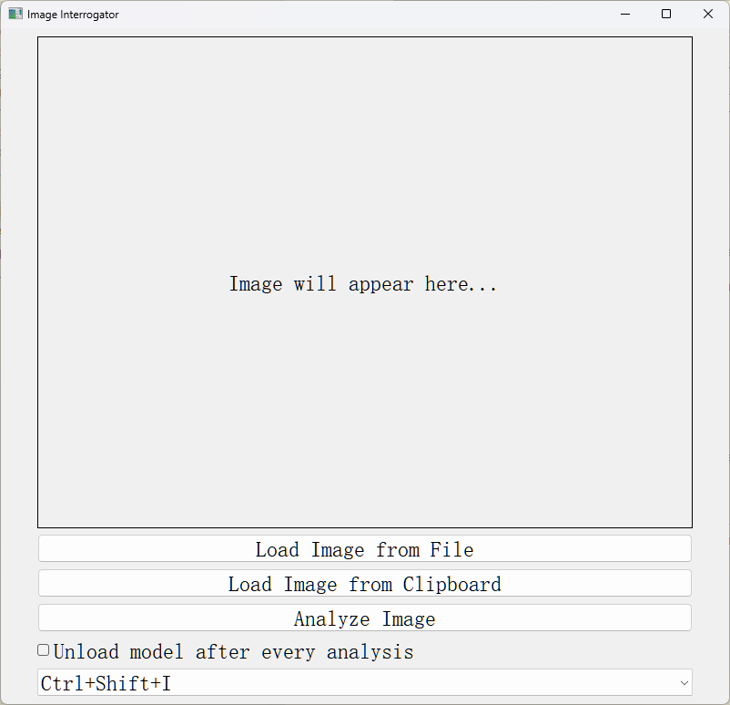
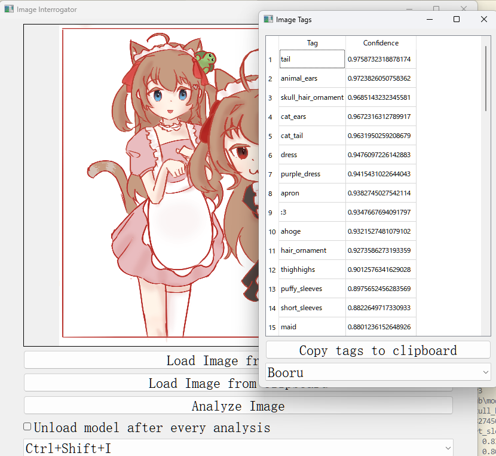

A GUI tool for labeling image from your clipboard or file system using wd tagger
---
## How to install and run

### Use the pre-built executable

1. Download the latest release from [here]
2. Right click on the downloaded file and select `Run` or `Open`
3. Wait for the application to start

(Windows excutable gives false positive on some antivirus software, you can build the executable yourself if you don't trust the pre-built one)

### Use the source code

1. Create a virtual environment and activate it

```bash
python3 -m venv venv
```

for windows
```bash
./venv/scripts/activate
```

for macos and linux
```bash
source venv/bin/activate
```

2. Install the requirements

```bash
pip install -r requirements.txt
```

3. Run the application

```bash
python gui.py
```

It may take a while to initialize the application for the first time.

## How to use

1. Copy an image to your clipboard or select a file
2. Click on the `load image from clipboard` or `load image from file` button
3. Click on the `analyze image` button or press a keybinding.
4. The tags will be displayed in a new window (First time will take a while to download pre-trained model)
5. You can copy the tags to your clipboard by clicking on the `copy tags to clipboard` button

Extra: 
- Check `Unload model after every analysis` can save you some memory, but it will take longer to analyze the image
- You can choose tag format, currently support `Booru` and `Stable Diffusion` format

## Configuration
After the first run, a `config.ini` file will be created in the same directory as the script. You can change the configuration there.

```ini
[GUI]
shortcut = Ctrl+Shift+I
unload_model_when_done = False
tag_format = booru

[Tagger]
model = wd-swinv2-v3
threshold = 0.35
```

Default model is `wd-swinv2-v3` and I also recommend these models:
- `wd-swinv2-v3` (default, with overall good performance)
- `wd-convnext-v3` (might deals rotated images better than other models)
- `wd-vit-v3` (good at character recognition)
- `wd14-moat-v2` (Incase you want to use the old model)

Default confidence threshold is `0.35`, lower it if you want more tags (less accurate).

## Known issues
- User from china mainland might have trouble downloading the model from huggingface
- macOS keybinding works by excute the script in IDEs (e.g. PyCharm or VSCode), but not in terminal. And it needs you to trust the IDE in `System Preferences -> Security & Privacy -> Privacy -> Input Monitoring` (Not a safe practice, use at your own risk)
- switch keybinding through GUI crahes on macOS (not sure why)

## Copyright
Original code by https://github.com/picobyte/stable-diffusion-webui-wd14-tagger

Public domain, except borrowed parts (e.g. `dbimutils.py`)
