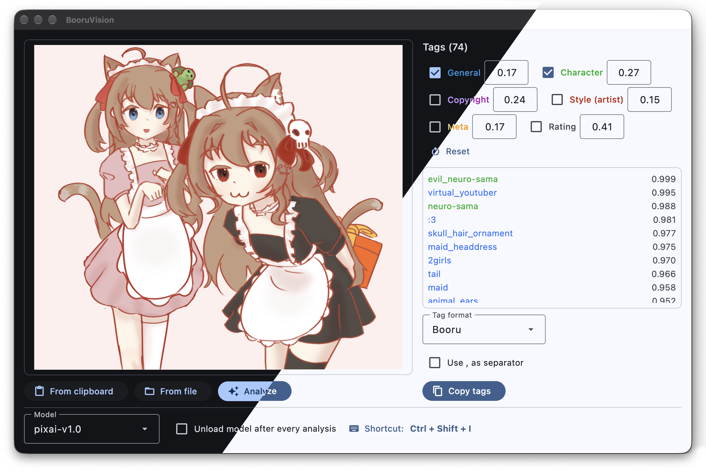

[English](../README.md) | [简体中文](README.zh-CN.md) | **日本語**

WD tagger と PixAI tagger のモデルを使って、クリップボードやファイルの画像にタグを付ける GUI ツールです。
Windows、macOS、Linux で動作します（[Flet](https://flet.dev) で作られています）。

---
## インストールと起動
[](https://github.com/MILES-FAN/booruvision/releases/)
[](https://github.com/MILES-FAN/booruvision/releases/)

### ビルド済みのアプリを使う

1. [こちら](https://github.com/MILES-FAN/booruvision/releases/)からお使いのプラットフォーム向けの最新版をダウンロードします：
   `BooruVision-windows-x64.zip`、`BooruVision-macos-arm64.zip`（Apple シリコン）、または `BooruVision-linux-x64.tar.gz`
2. 展開して `BooruVision` を開きます
3. アプリが起動するまで待ちます

macOS 版は公証されていないため、初回起動は Gatekeeper にブロックされます。アプリを右クリックして
「開く」を選ぶか、`xattr -dr com.apple.quarantine BooruVision.app` を実行してください。

### ソースから実行する

[uv](https://docs.astral.sh/uv/) が必要です。

```bash
uv sync                          # .venv を作成し、ロックされた依存関係をインストール
uv run python src/main.py        # アプリを起動
```

macOS では、初回起動時に名前とアイコンを BooruVision にした Flet クライアントのコピーを `.flet-client/`
に作成します。これにより Dock とメニューバーに正しいアプリ名が表示されます。ホットリロードを使う場合は
`FLET_VIEW_PATH=.flet-client uv run flet run src/main.py` を実行してください（`flet run` はアプリのコードより
先にクライアントを開くため、パスを事前に指定する必要があります）。

初回の解析では選択したモデルを Hugging Face からダウンロードするため、しばらく時間がかかります。

## 使い方


1. 画像（またはファイルマネージャー上の画像ファイル）をクリップボードにコピーするか、ファイルを選びます
2. 「クリップボードから」または「ファイルから」をクリックします
3. 「解析」をクリックするか、グローバルショートカットを押すと、クリップボードの読み込みと解析を一度に行います
4. タグは画像の横のパネル（ウィンドウが狭い場合は画像の下）に、Danbooru のカテゴリごとに色分けされて表示されます：
   一般、キャラクター、作品、画風（絵師）、メタ
5. タグ一覧の上で必要なカテゴリにチェックを入れ、「タグをコピー」をクリックすると、選択した形式でコピーされます

しきい値やチェックしたカテゴリを変更すると、画像を解析し直さずにすぐ一覧が更新されます。

その他：
- 画面は英語、簡体字中国語、日本語に対応しています。デフォルトではシステムの言語に従い、設定ページで変更できます
  （下部バーの「ショートカット：…」をクリック）
- 「解析のたびにモデルをアンロード」を有効にするとメモリを節約できますが、解析のたびにモデルを読み込み直します
- タグ形式は `Booru` または `Stable Diffusion` を選べ、区切り文字はスペースか `, ` を選べます

## グローバルショートカット
デフォルトのショートカットは `Ctrl+Shift+I` です。変更するには、下部バーの「ショートカット：…」をクリックして
設定ページを開き、修飾キーにチェックを入れてキー（A–Z、0–9、F1–F24）を選ぶか、「記録」をクリックして新しい
組み合わせを押します。「適用」をクリックすると登録されます。その組み合わせがすでに使われている場合は、
以前のショートカットがそのまま残ります。

動作の仕組みはプラットフォームによって異なります：

| プラットフォーム | 仕組み | 備考 |
|---|---|---|
| Windows | `RegisterHotKey` | 他のアプリがその組み合わせを使っている場合はメッセージを表示して失敗します |
| macOS | `CGEventTap` | **入力監視**の許可が必要です：「システム設定 → プライバシーとセキュリティ → 入力監視」で BooruVision（ソースから実行している場合はターミナル）を有効にし、アプリを再起動してください。`Ctrl` は Control キーです |
| Linux (X11) | `XGrabKey` | どの X11 セッションでも動作します |
| Linux (Wayland) | xdg-desktop-portal GlobalShortcuts | KDE Plasma と GNOME 48 以降。初回はデスクトップがショートカットの確認を求めます。変更はシステムのキーボード設定で行います |

利用できる仕組みがない場合でもアプリは動作し、ショートカットが無効になっている理由を表示します。

## 設定
設定はユーザー設定ディレクトリの `config.ini` に自動で保存されます：

- Windows：`%LOCALAPPDATA%\booruvision\config.ini`
- macOS：`~/Library/Application Support/booruvision/config.ini`
- Linux：`~/.config/booruvision/config.ini`

作業ディレクトリに旧バージョンの `config.ini` がある場合は、初回起動時に取り込まれます。

```ini
[GUI]
shortcut = Ctrl+Shift+I
language = auto
unload_model_when_done = False
tag_format = Booru
comma_separated = False
categories = general,character,copyright

[Tagger]
model = wd-swinv2-v3
threshold = 0.35

# 推奨値から変更したしきい値だけが書き込まれます
[Thresholds pixai-v1.0]
general = 0.25
```

`language` には `auto`（システムに従う）、`en`、`zh`、`ja` を指定できます。

デフォルトのモデルは `wd-swinv2-v3` です。ほかに次のモデルもおすすめです：
- `wd-swinv2-v3`（デフォルト。全体的に性能が良い）
- `wd-convnext-v3`（回転した画像に他のモデルより強い可能性があります）
- `wd-vit-v3`（キャラクターの認識が得意）
- `wd14-moat-v2`（旧モデルを使いたい場合）

デフォルトの信頼度しきい値は `0.35` です。下げるとタグが増えます（精度は下がります）。

### PixAI tagger
- `pixai-v1.0`：[PixAI Tagger v1.0](https://huggingface.co/pixai-labs/pixai-tagger-v1.0)。約 31,000 個のタグを、
  一般、キャラクター、作品、画風（絵師）、メタ、レーティングのカテゴリで出力します
- `pixai-v0.9`：[PixAI Tagger v0.9](https://huggingface.co/pixai-labs/pixai-tagger-v0.9)。一般タグとキャラクタータグを
  出力し、作品タグは検出されたキャラクターから推定します

PixAI モデルは、1 本のスライダーではなくカテゴリごとにしきい値を持ちます。各しきい値はモデルの推奨値から始まり、
カテゴリの横で編集できます（「リセット」で推奨値に戻ります）。WD モデルよりかなり大きく、初回の解析で
v1.0 は約 2 GB、v0.9 は約 1.3 GB をダウンロードします。v1.0 は約 4 GB のメモリを使い、CPU では 1 枚あたり数秒かかります。

## 既知の問題
- 中国本土のユーザーは Hugging Face からモデルをダウンロードできない場合があります

## 著作権
オリジナルのコード：https://github.com/picobyte/stable-diffusion-webui-wd14-tagger

借用した部分（`tagging/preprocess.py` など）を除き、パブリックドメインです。
